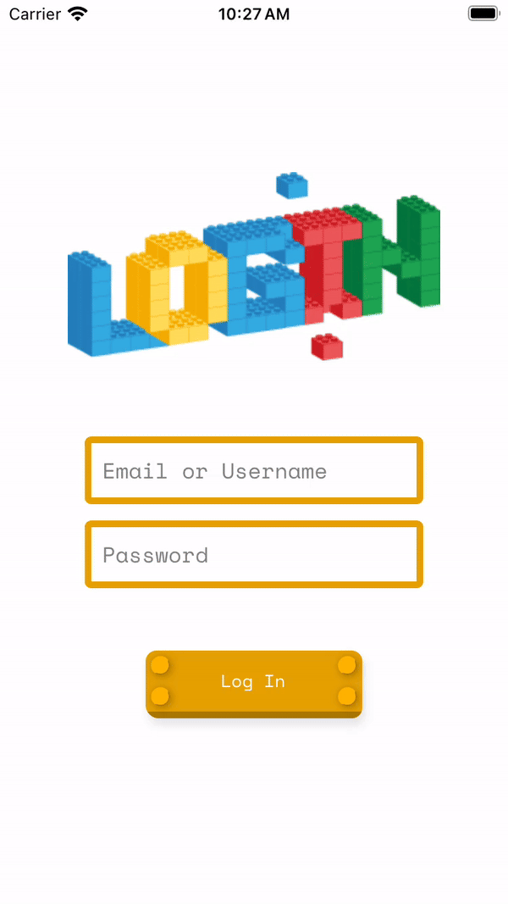
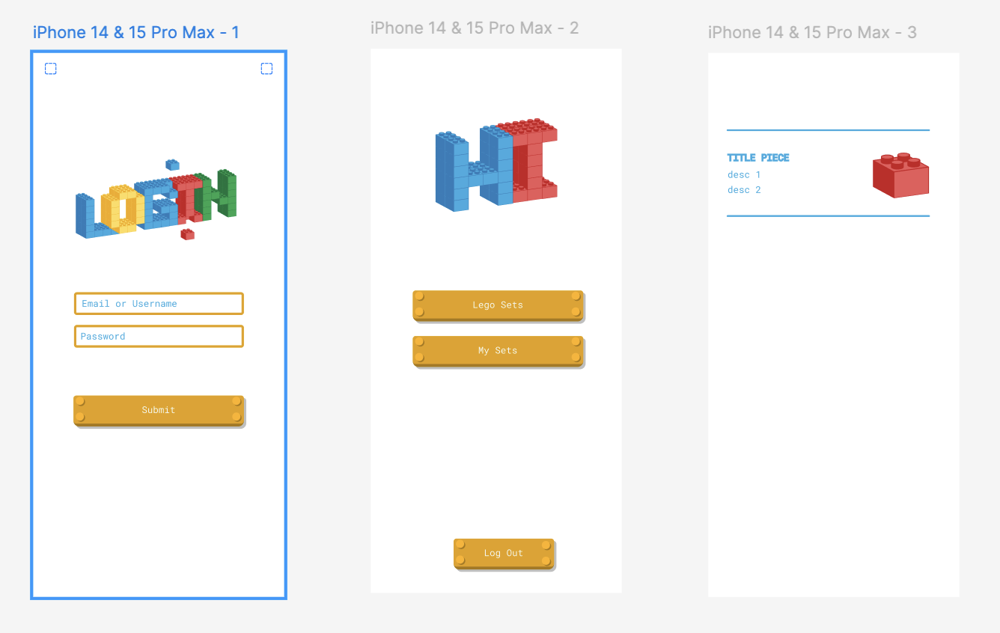

# Lego

An app to add parts to Rebrikable Sets as your Sets.

### Visit app
You can visit the current web version of the app here [HERE](https://giftify-lego.vercel.app)

##### Android and iOS
<div>
 
 
</div>

### Figma



[Figma design](https://www.figma.com/design/8PC84TxdohJaXYDjJN2Nkz/Lego?node-id=0-1&t=K0UkUEivyoXQxEgm-1) of few screens.

### Tech stack

In order to make this simple, I'm going to use [Expo](https://docs.expo.dev/get-started/introduction/).

 - create-expo-app@3.0.0
 - Versel (deploy webapp)

### API
From official website v3
https://rebrickable.com/api/v3/docs
(With Swagger for docs 💛)


### Install instructions - locally run
With NVM run "nvm use" or install 20.14.x
Be sure that .env file have keys 
      EXPO_PUBLIC_TEST_API_REBRICKABLE=api_key;
Follow "Get started" on expo basic section


----------
##### Expo app basics

# Welcome to your Expo app 👋

This is an [Expo](https://expo.dev) project created with [`create-expo-app`](https://www.npmjs.com/package/create-expo-app).

## Get started

1. Install dependencies

   ```bash
   npm install
   ```

2. Start the app

   ```bash
    npx expo start
   ```

In the output, you'll find options to open the app in a

- [development build](https://docs.expo.dev/develop/development-builds/introduction/)
- [Android emulator](https://docs.expo.dev/workflow/android-studio-emulator/)
- [iOS simulator](https://docs.expo.dev/workflow/ios-simulator/)
- [Expo Go](https://expo.dev/go), a limited sandbox for trying out app development with Expo

You can start developing by editing the files inside the **app** directory. This project uses [file-based routing](https://docs.expo.dev/router/introduction).

